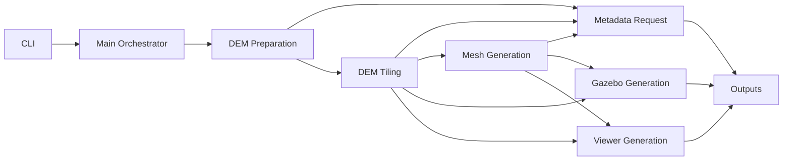
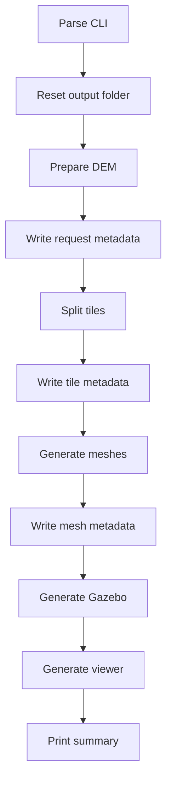

# Application Flow

This diagram shows the main terrain-generation application blocks and how data
moves between them. The application starts with CLI input, creates terrain
artifacts under the selected world output folder, records the reduced
application metadata shape, and prints a final summary.

## Block Summaries

- `CLI`: parses world name, coordinates, area size, optional DEM file, output
  directory, tile size, texture path, and log level.
- `Main Orchestrator`: configures logging, confirms output-folder reset, prints
  start/completion banners, and runs the pipeline stages in order.
- `DEM Preparation`: downloads a DEM from OpenTopography or copies the local
  `--dem-file` into the world output folder as `dem.tif`.
- `Metadata Request`: records the reduced application metadata: world name,
  requested center/size, requested bounds, elevation stats, tile count, mesh
  count, and Z normalization.
- `DEM Tiling`: splits the DEM into tile rasters and writes `tiles.csv`, which
  later stages use for placement and sizing.
- `Mesh Generation`: converts tile data into normalized Collada terrain meshes
  and records mesh count plus Z offset.
- `Gazebo Generation`: creates Gazebo terrain models, worlds, levels, GUI
  camera setup, and the level probe model. These outputs are generated but are
  not first-class metadata sections.
- `Viewer Generation`: creates the combined browser-viewable `terrain.glb` and
  `index.html`. These outputs are generated but are not first-class metadata
  sections.
- `Outputs`: stores generated artifacts under `outputs/<world-name>/`, including
  DEM, tiles, meshes, Gazebo files, viewer files, and application metadata.

## Execution Order

