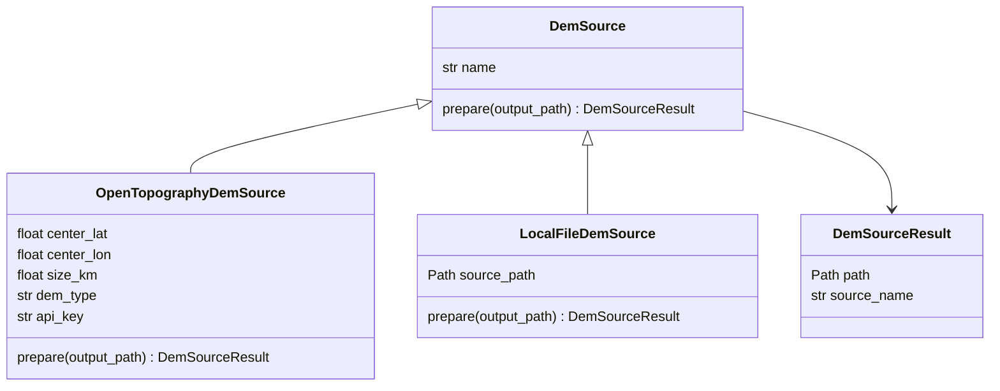

# DEM Source Model

DEM sources prepare the canonical `dem.tif` used by the rest of the pipeline.
Each source writes or copies a readable GeoTIFF to the requested output path, so
tiling, mesh generation, Gazebo generation, and viewer generation do not need to
know where the DEM came from.



## Current Sources

- `OpenTopographyDemSource`: downloads COP30 DEM data from OpenTopography using
  the requested center coordinate and square area size.
- `LocalFileDemSource`: copies an existing GeoTIFF selected with `--dem-file`.

Source selection is handled by `dem_source_from_config(...)`:

- `--dem-file /path/to/file.tif` selects `LocalFileDemSource`.
- Omitting `--dem-file` selects `OpenTopographyDemSource`.

## Implementing A New Source

To add another DEM provider:

1. Create a new `DemSource` subclass.
2. Implement `prepare(output_path: Path) -> DemSourceResult`.
3. Make `prepare(...)` write, copy, or download a readable GeoTIFF to
   `output_path`.
4. Return `DemSourceResult(path=output_path, source_name="<source-name>")`.
5. Extend `dem_source_from_config(...)` to select the new source.

Downstream stages always read the same canonical DEM path:

```text
outputs/<world-name>/dem.tif
```

That keeps later pipeline stages independent of the DEM provider.
