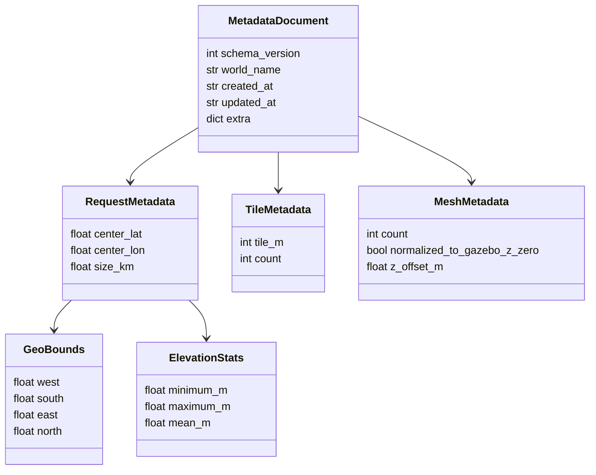

# Application Metadata Design

Application metadata is the in-memory summary of one generated terrain world.
It gives the pipeline and CLI a typed way to describe the requested area, actual
world location, elevation range, generated tiles, and mesh normalization.

An arrow in the diagram means the class contains that class as one of its
fields.

## Main Values

- `world_name`: the generated world name and default output folder name.
- Requested center: `RequestMetadata.center_lat` and
  `RequestMetadata.center_lon`.
- Requested square area size: `RequestMetadata.size_km`.
- Bounding box: represented by `GeoBounds` with west, south, east, and north
  coordinates.
- Elevation range: `ElevationStats.minimum_m`, `maximum_m`, and `mean_m`.
- Tile size: `TileMetadata.tile_m`.
- Number of tiles: `TileMetadata.count`.
- Mesh count: `MeshMetadata.count`.
- Z normalization: `MeshMetadata.normalized_to_gazebo_z_zero` and
  `MeshMetadata.z_offset_m`.

## Class Notes

- `MetadataDocument` is the root object for one generated world.
- `RequestMetadata` describes the requested center coordinate and square area
  size.
- `TileMetadata` describes generated tile size and count.
- `MeshMetadata` describes generated mesh count and Z normalization.
- `GeoBounds` and `ElevationStats` are small value objects used by
  `RequestMetadata`.
